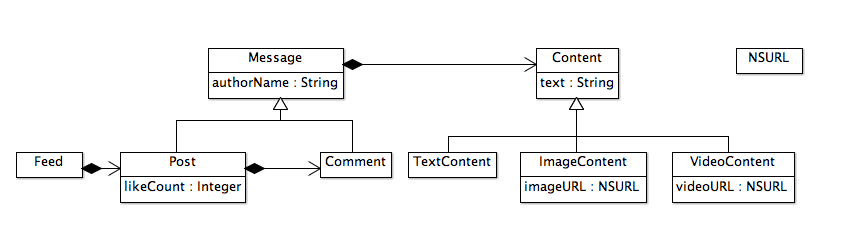

Моделирование сущностей приложения Futubra
==========================================

## Идентификация сущностей

Идентификация сущностей - это первое, с чего начинается любое приложение. Обычно в
хорошем техническом задании (ТЗ) они легко ищутся и достаточно внимательно его прочитать
несклько раз. Основными кандидатами на попадание в модель являются те имена сущностей,
которые упомянаются в тексте на периодической основе. Итак, анализируем ТЗ.

<ol>
  <li>В <b>ленте</b> сообщений находится неограниченное число <b>постов</b>. Они могут удаляться и добавляться туда с течением времени.</li>
  <li>Каждый <b>пост</b> имеет следующие атрибуты:
    <ol>
      <li>Имя пользователя (не изменяется в течение времени жизни поста)</li>
      <li>Счетчик лайков (пользователи могу лайкать пост и отзывать свои лайки)</li>
      <li><b>Комментарии</b> (могут добавляться и убавляться)</li>
      <li><b>Контент</b> (не изменяется в течение времени жизни поста).</li>
    </ol>
  </li>
  <li><b>Контент</b> в <b>постах</b> бывает *3-х типов*:
    <ol>
      <li>Просто <i>текстовый</i> (обязателен по крайней мере один символ)</li>
      <li><i>Картиночный</i> с опциональной текстовой подписью. Картинка задается в виде обязательного NSURL на внешний ресурс.</li>
      <li><i>Видеопост</i> с опциональноий текстовой подписью. Видео задается в виде обязательного NSURL на внешний ресурс.</li>
    </ol>
  </li>
  <li>Каждый <b>комментарий</b> имеет следующие атрибуты:
    <ol>
      <li>Имя пользователя (не изменяется в течение времени жизни поста)</li>
      <li><b>Контент</b> (не изменяется в течение времени жизни поста). Может быть любого вида из п.3.</li>
    </ol>
  </li>
  <li><b>Комментарии</b> имеет плоскую структуру. <b>Комментариев</b> к <b>комментариям</b> не бывает.</li>
</ol>

Итак, сущности идентифицированы. Комментарий и пост имеют семантически много общего. Оба из них
являются носителями контента, произведенным неким пользователем. Данный факт наводит на мысль
о выделении некого общего базового класса. Кто бы им мог быть? Вспоминаем, что в объектно-ориентированном
программировании наследование допустимо использовать только при моделировании отношений "ЯВЛЯЕТСЯ".
Если некий класс `B` наследуется от класса `A`, то это означается, что `B` ЯВЛЯЕТСЯ `A`. Само
по себе наличие одинаковых атрибутов не является достаточным основанием для наследования. Поэтому,
например, класс "Контент" не может быть базовым для поста и комментариев, поскуольку они СОДЕРЖАТ
в себе контент, а это отношение моделируеся агрегацией, т.е. заведением переменной-члена (instance
variable, он же ivar в Objective-C). Похоже, что среди выделенных сущностей нет подходящего кандидата
на роль базового класса, вводим его сами - им будет класс "Сообщение".

Итоговая диаграмма выглядит следующим образом

Несколько комментариев.

<ol>
  <li>Несмотря на то, что в классе `Comment` нет каких-то атрибутов в дополнение к оным базового класса,
  мы все равно моделируем комментарий в виде отдельного класса. Если бы мы его не зводили и класс `Post`
  агрегировал бы в себе объекты класса `Message`, то получилось бы, что посты могли бы содержать в себе
  посты и комментарии. В итоге бы мы имели древовидную структуру, что противоречит модели.</li>
  <li>Несмотря на то, что в классе `TextContent` нет каких-то атрибутов в дополнение к оным базового класса,
  мы его заводим, потому что у него другой контракт. В отличие от базового класса, текстовый контент
  гарантирует наличие в себе текста, чего нельзя сказать про другие типы контента. Данынй факт находит свое
  отражение в атрибуте `nonnull` его свойства `text`. Контракт - такое же важное являение в модели, как все
  остальное.</li>
  <li>Несмотря на то, что в классы `ImageContent` и `VideoContent` имеют одинаковый состав атрибутов,
  мы их моделируем в виде отдельных классов, посольку `ImageContent` - это не то же самое, что `VideoContent`.
  Завтра может статься, что картинка будет задаваться в виде физического UIImage и при соответствующем
  рефакторинге постраают только пользователи класса `ImageContent`.</li>
</ol>
